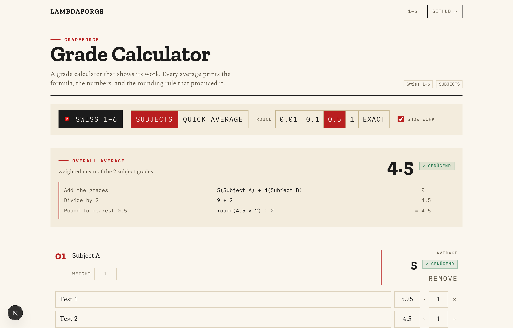

# GradeForge

> A local-only grade calculator that prints the exact formula behind every number, for any country's grading system.


GradeForge is a browser-only weighted-average calculator that shows its work. Enter your grades, pick a system, and for every average it prints the inputs, the formula, and the rounding rule it applied: no accounts, no portal, nothing leaving the page. It ships with ~20 country presets and a custom-scale builder, so it handles count-up scales (Switzerland 1–6, France 0–20), count-down scales (Germany and Austria, where 1 is best and 4 still passes), and letter or GPA scales (US/Canada, Denmark's 7-trin), each with its own bounds, pass mark, decimals, and localized verdict word.

<p align="center">
  <br>
  <sub>The Subjects view with a worked average (sample data)</sub>
</p>

## Quickstart

```bash
git clone https://github.com/lambdaf-org/grade-forge
cd grade-forge
npm install
npm run dev
```

Open http://localhost:3000. On first launch a selection screen blocks until you pick a grading system; your choice persists in the browser and seeds a small set of example grades. Everything runs client-side; there is no server or database, and no data ever leaves your browser.

### Grading systems

Each system is one entry in `lib/systems.ts` that the engine and UI pick up with no other changes. A system defines:

| Field | Purpose |
| --- | --- |
| `bounds` | Worst and best grade on the scale |
| `direction` | Whether higher or lower is better (sets how "pass" is compared) |
| `pass` | The pass mark |
| `decimals` | Display precision |
| `rounding` | Rounding mode, e.g. nearest `0.1` or GPA's `0.01` |
| `labels` | Localized verdict words (genügend / bestanden / suffisant / aprobado …) |
| `letters` | Optional letter↔value map for GPA-style scales |

Adding a country is a single line in this file. Anything not listed is covered by the **custom scale** builder (worst / best / pass mark / higher-or-lower-is-better).

## Features

- **Shows its work**: every average prints its inputs, the exact weighted formula, and the rounding rule applied. The receipt *is* the feature.
- **Universal systems**: ~20 presets plus a custom-scale builder, switchable any time from the system pill in the toolbar. Changing systems keeps your grades; only the first pick seeds example data.
- **Direction-aware**: count-up and count-down scales are handled correctly, so a pass is `value ≥ pass` in Switzerland and `value ≤ pass` in Germany, and points→grade formulas flip accordingly.
- **Letter and GPA scales**: pick letters from a dropdown; they're averaged by their numeric values and the receipt shows both: `4(A) + 3(B) = 7`.
- **Two views**: **Subjects** for a structured weighted breakdown, **Quick average** for a flat weighted mean when you don't need the structure.
- **Localized verdicts**: bounds, pass mark, decimals, rounding, and the verdict word all come from the chosen system, including its language.
- **Local-first**: no accounts, no network calls, no telemetry. State lives in your browser.

## How it works

The engine takes a list of `(grade, weight)` pairs and the active system, computes the weighted mean, applies the system's rounding mode, and returns both the number and a structured receipt of how it got there. The UI renders that receipt verbatim, so the formula on screen is the computation that actually ran.

Direction is a property of the system rather than the engine: a count-down scale flips the comparison and the points→grade mapping, so 80% on the German 1–5 scale yields 1.8 and reads as a pass. Letter scales carry a value map, average on the numbers, and surface both letter and value in the receipt. Pass marks and rounding conventions genuinely vary *within* some countries, so the presets ship sensible defaults and leave rounding adjustable rather than pretending there's one correct rule.

## Adding a grading system

```ts
// lib/systems.ts
export const systems = {
  // ...
  myCountry: {
    bounds: { worst: 1, best: 6 },
    direction: "higher-is-better",
    pass: 4,
    decimals: 1,
    rounding: 0.1,
    labels: { pass: "passed", fail: "failed" },
  },
};
```

The engine reads `direction`, `bounds`, `pass`, `rounding`, and `decimals` directly, and the selection screen and toolbar pill list the new entry automatically.

## Deployment

GradeForge is a standard Next.js app and stays fully client-side, so it deploys anywhere static or serverless:

```bash
npm run build
npm start
```

Or deploy straight to Vercel (or any static host via `next build` output). There are no secrets, environment variables, or backing services to configure.

## Contributing

Lambdaforge is open source and contributions are welcome. Start with the [contributor guide](https://github.com/lambdaf-org/contributing), and see the org-wide [CONTRIBUTING](https://github.com/lambdaf-org/.github/blob/main/CONTRIBUTING.md) and [Code of Conduct](https://github.com/lambdaf-org/.github/blob/main/CODE_OF_CONDUCT.md).

## License

This repository does not yet include a `LICENSE` file, so default copyright applies for now. A license is coming soon. If you want to use or build on this before then, please open an issue.